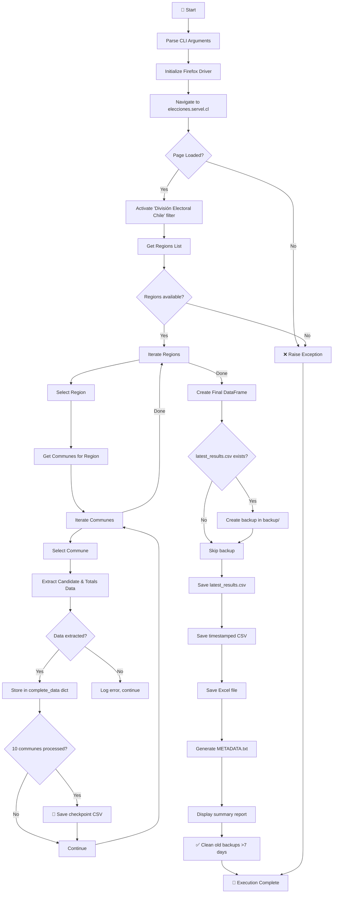
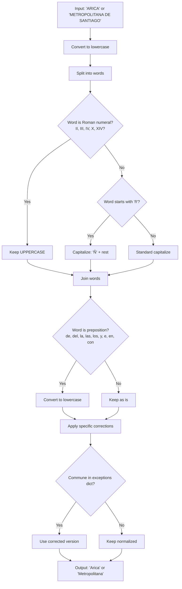
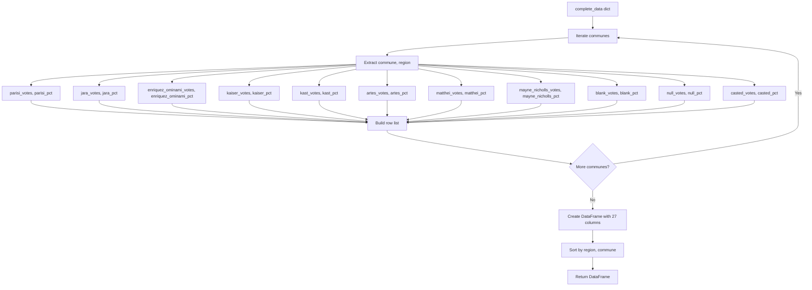

# 🌐 Script: Web Scraper - Chilean First Round Election 2025

  

  [](https://selenium.dev) 

## 📥 Quick Downloads

| Document                     | Format                                                       |
| :--------------------------- | :----------------------------------------------------------- |
| **🇬🇧 English Documentation** | [PDF](https://drive.google.com/file/d/example_en) |
| **🇪🇸 Spanish Documentation** | [PDF](https://drive.google.com/file/d/example_es) |

## 📋 General Description

This script is the **first-round electoral results scraper** for the Chilean Presidential Elections 2025. It automates the extraction of election results from the official SERVEL website, processing all communes across 16 regions of Chile and generating structured CSV outputs optimized for data analysis.

The script uses **Selenium** with Firefox WebDriver for browser automation, implements **name normalization** (converting 'ARICA' to 'Arica'), includes **automatic backup** before overwriting results, and provides **partial progress saving** every 10 communes to prevent data loss during long executions (25-40 minutes).

### Key Features

- **Complete Extraction**: Processes all communes across 16 regions of Chile
- **8 Candidates**: PARISI · JARA · ENRÍQUEZ-OMINAMI · KAISER · KAST · ARTES · MATTHEI · MAYNE-NICHOLLS
- **Name Normalization**: Converts uppercase names to title format (Arica vs ARICA)
- **Tidy Data Output**: Columns optimized for SQL (`snake_case`), Python, and DAX
- **Automatic Backup**: Creates backup before overwriting `latest_results.csv`
- **Partial Progress**: Saves intermediate results every 10 communes
- **Multi-format Export**: Generates CSV (primary), Excel (secondary), and metadata
- **Metadata Generation**: Automatic documentation of dataset structure
- **Headless Mode**: Support for server/automated environments

## 📊 Process Flow Diagram

### **Legend**

| Color        | Type          | Description                                           |
| :----------- | :------------ | :---------------------------------------------------- |
| 🔵 Blue       | Input / Start | SERVEL website, configuration, CLI arguments          |
| 🟠 Orange     | Process       | Browser automation, data extraction, file operations  |
| 🔴 Red        | Decision      | Conditional branching (selector works?, file exists?) |
| 🟢 Green      | Storage       | CSV outputs, backups, metadata, logs                  |
| 🟣 Purple     | External      | Firefox browser, GeckoDriver                          |
| 🟢 Dark Green | Output        | Final CSV, summary report                             |

### **Diagram 1: Main Flow Overview**



### **Diagram 2: Commune Data Extraction (per commune)**

```mermaid
flowchart TD
    A[Commune Name] --> B[Select commune from dropdown]
    B --> C[Wait 6 seconds for data load]
    C --> D[Find results table]
    
    D --> E{Table found?}
    E -->|No| F[❌ Return None, None]
    E -->|Yes| G[Get all rows tr]
    
    G --> H[Iterate rows]
    H --> I[Extract cells: Nombre, Votos, %]
    
    I --> J{Nombre contains?}
    J -->|BLANCO| K[Store in totals['blank']]
    J -->|NULO| L[Store in totals['null']]
    J -->|EMITIDO/TOTAL| M[Store in totals['casted']]
    J -->|Candidate name| N[Simplify name via CANDIDATE_MAP]
    
    N --> O[parisi, jara, enriquez_ominami, kaiser, kast, artes, matthei, mayne_nicholls]
    O --> P[Store in candidatos dict]
    K --> H
    L --> H
    M --> H
    P --> H
    
    H -->|Done| Q[Return candidatos, totals]
```

### **Diagram 3: Name Normalization Process**



### **Diagram 4: Final DataFrame Construction (8 Candidates)**



## 🔍 Detailed Analysis of `web_scraper.py`

### Code Structure

#### **1. Initial Configuration and Directories**

```python
ARCHIVE_DIR = Path("elections_archive")
BACKUP_DIR = ARCHIVE_DIR / "backup"
LATEST_CSV = ARCHIVE_DIR / "latest_results.csv"
LOG_FILE = ARCHIVE_DIR / "scraper_elections.log"
```

The script organizes data in a hierarchical structure:

| Directory                | Purpose                           | Retention             |
| :----------------------- | :-------------------------------- | :-------------------- |
| `elections_archive/`     | Main archive for extracted data   | Permanent             |
| `backup/`                | Temporary backup copies           | 7 days (configurable) |
| `latest_results.csv`     | Most recent results (overwritten) | Always current        |
| `election_matrix_*.csv`  | Timestamped historical files      | Permanent             |
| `election_matrix_*.xlsx` | Excel format for stakeholders     | Permanent             |
| `checkpoint_*.csv`       | Partial progress files            | Permanent             |
| `*.log`                  | Execution logs                    | Permanent             |


#### **2. Candidate Mapping System (8 Candidates)**

```python
self.CANDIDATE_MAP: dict[str, str] = {
    "FRANCO PARISI FERNANDEZ": "parisi",
    "JEANNETTE JARA ROMAN": "jara",
    "MARCO ANTONIO ENRIQUEZ-OMINAMI": "enriquez_ominami",
    "JOHANNES KAISER BARENTS-VON HOHENHAGEN": "kaiser",
    "JOSE ANTONIO KAST RIST": "kast",
    "EDUARDO ANTONIO ARTES BRICHETTI": "artes",
    "EVELYN MATTHEI FORNET": "matthei",
    "HAROLD MAYNE-NICHOLLS SECUL": "mayne_nicholls"
}
```

This dictionary maps full candidate names from SERVEL to simplified column names:

| Full Name                              | Simplified         | Column Names                                     |
| :------------------------------------- | :----------------- | :----------------------------------------------- |
| FRANCO PARISI FERNANDEZ                | `parisi`           | `parisi_votes`, `parisi_pct`                     |
| JEANNETTE JARA ROMAN                   | `jara`             | `jara_votes`, `jara_pct`                         |
| MARCO ANTONIO ENRIQUEZ-OMINAMI         | `enriquez_ominami` | `enriquez_ominami_votes`, `enriquez_ominami_pct` |
| JOHANNES KAISER BARENTS-VON HOHENHAGEN | `kaiser`           | `kaiser_votes`, `kaiser_pct`                     |
| JOSE ANTONIO KAST RIST                 | `kast`             | `kast_votes`, `kast_pct`                         |
| EDUARDO ANTONIO ARTES BRICHETTI        | `artes`            | `artes_votes`, `artes_pct`                       |
| EVELYN MATTHEI FORNET                  | `matthei`          | `matthei_votes`, `matthei_pct`                   |
| HAROLD MAYNE-NICHOLLS SECUL            | `mayne_nicholls`   | `mayne_nicholls_votes`, `mayne_nicholls_pct`     |


#### **3. Browser Initialization**

```python
def initialise_browser(self):
    options = Options()
    if self.headless:
        options.headless = True
    options.add_argument("--no-sandbox")
    options.add_argument("--disable-dev-shm-usage")
    options.add_argument("--window-size=1920,1080")
    
    self.driver = webdriver.Firefox(options=options)
```

**Configuration parameters:**

| Parameter                 | Purpose                            |
| :------------------------ | :--------------------------------- |
| `headless=True`           | Run without UI (server/CI/CD mode) |
| `--no-sandbox`            | Required for Linux environments    |
| `--disable-dev-shm-usage` | Prevents /dev/shm issues in Docker |
| `--window-size=1920,1080` | Ensures responsive layout loads    |


#### **4. Name Normalization Functions**

**`normalise_comuna_name()`**: Converts 'ARICA' → 'Arica'

| Input          | Output         | Rule                             |
| :------------- | :------------- | :------------------------------- |
| `ARICA`        | `Arica`        | Capitalize first letter          |
| `LAS CONDES`   | `Las Condes`   | Prepositions in lowercase        |
| `ÑUÑOA`        | `Ñuñoa`        | Respects 'Ñ' character           |
| `PUNTA ARENAS` | `Punta Arenas` | Multiple words handled correctly |

**`normalise_region_name()`**: Converts 'METROPOLITANA DE SANTIAGO' → 'Metropolitana'

| Input                                       | Output          | Rule                         |
| :------------------------------------------ | :-------------- | :--------------------------- |
| `METROPOLITANA DE SANTIAGO`                 | `Metropolitana` | Remove 'DE SANTIAGO' suffix  |
| `DEL LIBERTADOR GENERAL BERNARDO O'HIGGINS` | `Libertador`    | Remove prefix, keep key name |
| `DE VALPARAISO`                             | `Valparaíso`    | Remove 'DE', capitalize      |

#### **5. Data Extraction Logic**

**Table parsing process:**

```python
def _parse_results_table(self):
    table = self._find_results_table()
    
    for row in table.find_elements(By.TAG_NAME, "tr"):
        cells = row.find_elements(By.TAG_NAME, "td")
        name = cells[0].text.strip()
        votes = int(cells[1].text.replace('.', ''))
        pct = float(cells[2].text.replace('%', '').replace(',', '.'))
```

**Row classification:**

| Text contains  | Classification | Storage target     |
| :------------- | :------------- | :----------------- |
| `BLANCO`       | Blank votes    | `totals['blank']`  |
| `NULO`         | Null votes     | `totals['null']`   |
| `EMITIDO`      | Casted votes   | `totals['casted']` |
| Candidate name | Candidate      | `candidatos[name]` |

#### **6. Output File Structure**

**Primary output: `latest_results.csv`**

```text
commune,region,artes_votes,artes_pct,enriquez_ominami_votes,enriquez_ominami_pct,jara_votes,jara_pct,kaiser_votes,kaiser_pct,kast_votes,kast_pct,matthei_votes,matthei_pct,mayne_nicholls_votes,mayne_nicholls_pct,parisi_votes,parisi_pct,blank_votes,blank_pct,casted_votes,casted_pct,null_votes,null_pct
Arica,Arica y Parinacota,1200,3.50,2500,7.30,8000,23.40,500,1.46,15000,43.80,3200,9.35,1800,5.26,1800,5.26,500,1.46,34200,100.00,450,1.31
Santiago,Metropolitana,15000,4.20,28000,7.84,85000,23.80,5200,1.46,142000,39.76,35000,9.80,22000,6.16,22000,6.16,5200,1.46,357200,100.00,3800,1.06
```


**Column naming convention (English):**

| Column              | Type    | Description                          |
| :------------------ | :------ | :----------------------------------- |
| `commune`           | TEXT    | Normalized commune name              |
| `region`            | TEXT    | Normalized region name               |
| `{candidate}_votes` | INTEGER | Votes for candidate (0-8 candidates) |
| `{candidate}_pct`   | FLOAT   | Percentage for candidate (0-100)     |
| `blank_votes`       | INTEGER | Blank votes                          |
| `blank_pct`         | FLOAT   | Blank votes percentage               |
| `null_votes`        | INTEGER | Null votes                           |
| `null_pct`          | FLOAT   | Null votes percentage                |
| `casted_votes`      | INTEGER | Total casted votes                   |
| `casted_pct`        | FLOAT   | Total casted votes percentage        |

#### **7. Backup and Cleanup System**

**Backup creation:**

```python
def create_backup_before_update():
    if LATEST_CSV.exists():
        timestamp = datetime.now().strftime("%Y%m%d_%H%M%S")
        backup_filename = BACKUP_DIR / f"backup_latest_results_{timestamp}.csv"
        shutil.copy2(LATEST_CSV, backup_filename)
```

**Cleanup policy:**

| Item    | Retention | Configurable     |
| :------ | :-------- | :--------------- |
| Backups | 7 days    | `days` parameter |

```python
def cleanup_old_backups(days: int = 7):
    """Remove backup files older than specified days."""
```


#### **8. Partial Progress Saving**

```python
def _save_partial_progress(self):
    if self.processed_comunas % 10 == 0:
        filename = f"checkpoint_{self.processed_comunas}_communes_{timestamp}.csv"
        df_partial.to_csv(filename)
```


**File naming example:** `checkpoint_120_communes_20251125_140235.csv`

#### **9. Metadata Generation**

```python
def _write_metadata_file(self, df: pd.DataFrame, csv_filename: Path):
    """Create METADATA.txt with dataset documentation"""
```

**Generated metadata includes:**

- Generation timestamp

- Total communes and regions

- Column descriptions and types

- Candidate dictionary (8 candidates)

- SQL, Python, and DAX usage examples

  

------

## ⚙️ Local Execution Guide

### No GitHub Actions (Local Only)

This script is designed for **local execution only** due to:

- **Execution time**: 25-40 minutes
- **Browser dependency**: Requires Firefox with GUI (headless mode available)
- **Manual triggering**: Electoral results are one-time events

### Execution Triggers

This script runs **only manually**:

| Trigger               | Method                                       |
| :-------------------- | :------------------------------------------- |
| **Command line**      | `python web_scraper.py`                      |
| **Headless mode**     | `python web_scraper.py --headless`           |
| **Test mode**         | `python web_scraper.py --comunas 50`         |
| **Verbose debugging** | `python web_scraper.py --verbose --headless` |

### Environment Variables

| Variable         | Value  | Purpose                                 |
| :--------------- | :----- | :-------------------------------------- |
| `GITHUB_ACTIONS` | `true` | Disables interactive prompts (optional) |

------

## 🚀 Installation and Local Setup

### Prerequisites

- Python 3.7 or higher (3.12 recommended)
- Firefox browser installed
- Git installed (optional)
- Internet access for SERVEL website

### Step-by-Step Installation

#### 1. **Clone the Repository**

```bash
git clone https://github.com/adroguetth/Chilean-Presidential-Elections-2025-Analysis.git
cd Chilean-Presidential-Elections-2025-Analysis/first_round/1_web_scraper
```


#### 2. **Install GeckoDriver**

```bash
# Ubuntu/Debian
sudo apt-get update
sudo apt-get install firefox firefox-geckodriver

# macOS
brew install firefox geckodriver

# Windows
# Download from: https://github.com/mozilla/geckodriver/releases
# Add to PATH or place in script directory
```


#### 3. **Create Virtual Environment (recommended)**

```bash
python -m venv venv

# Windows
venv\Scripts\activate

# Linux/Mac
source venv/bin/activate
```


#### 4. **Install Dependencies**

```bash
pip install -r requirements.txt
```


#### 5. **Run Initial Test**

```bash
# Quick test with only 10 communes
python web_scraper.py --comunas 10 --headless

# Full execution (25-40 minutes)
python web_scraper.py --headless
```


### Development Configuration

```bash
# Simulate headless environment
export GITHUB_ACTIONS=true

# Run with visible browser (remove --headless flag)
python web_scraper.py

# Enable debug logging
python web_scraper.py --verbose
```


------

## 📁 Generated File Structure

```text
first_round/1_web_scraper/
├── web_scraper.py                  # Main script
├── requirements.txt                # Python dependencies
└── elections_archive/
    ├── backup/
    │   ├── backup_latest_results_20251125_143022.csv
    │   └── backup_latest_results_20251124_091503.csv
    ├── latest_results.csv          # Most recent results (always overwritten)
    ├── election_matrix_346_communes_20251125_143022.csv
    ├── election_matrix_346_communes_20251125_143022.xlsx
    ├── election_matrix_346_communes_20251125_143022_METADATA.txt
    ├── checkpoint_10_communes_20251125_140101.csv
    ├── checkpoint_20_communes_20251125_140235.csv
    ├── ...
    └── scraper_elections.log       # Execution log
```


### Naming Convention

| Type                | Pattern                                                | Example                                                     |
| :------------------ | :----------------------------------------------------- | :---------------------------------------------------------- |
| Latest results      | `latest_results.csv`                                   | `latest_results.csv`                                        |
| Timestamped results | `election_matrix_{communes}_communes_{timestamp}.csv`  | `election_matrix_346_communes_20251125_143022.csv`          |
| Excel output        | `election_matrix_{communes}_communes_{timestamp}.xlsx` | `election_matrix_346_communes_20251125_143022.xlsx`         |
| Partial progress    | `checkpoint_{communes}_communes_{timestamp}.csv`       | `checkpoint_120_communes_20251125_140235.csv`               |
| Metadata            | `{csv_filename}_METADATA.txt`                          | `election_matrix_346_communes_20251125_143022_METADATA.txt` |
| Backup              | `backup_latest_results_{timestamp}.csv`                | `backup_latest_results_20251125_143022.csv`                 |
| Log                 | `scraper_elections.log`                                | `scraper_elections.log`                                     |

------

## 🔧 Customization and Configuration

### Adjustable Parameters in Script

```python
# In web_scraper.py (ServelElectionScraper class)
self.WAIT_PAGE_LOAD = 15      # Initial page load (seconds)
self.WAIT_DROPDOWN_SELECT = 5 # Region/commune selection
self.WAIT_TABLE_RENDER = 6    # Wait after selection

# Backup retention
def cleanup_old_backups(days: int = 7):
    """Modify days parameter for different retention"""
```

### CLI Arguments

| Argument      | Description                       | Example                              |
| :------------ | :-------------------------------- | :----------------------------------- |
| `--headless`  | Run Firefox without GUI           | `python web_scraper.py --headless`   |
| `--comunas N` | Limit to N communes (for testing) | `python web_scraper.py --comunas 50` |
| `--verbose`   | Enable detailed debug logging     | `python web_scraper.py --verbose`    |

### Modify Candidate Mapping

```python
# If candidate names change on the site, update:
self.CANDIDATE_MAP = {
    "NEW_PARISI_NAME": "parisi",
    "NEW_JARA_NAME": "jara",
    # ... etc
}
```


### Process Only Specific Regions

```python
# Modify in _process_region method:
desired_regions = ["METROPOLITANA DE SANTIAGO", "DE VALPARAISO"]
if region_name in desired_regions:
    # Process region
else:
    continue
```


------

## 📈 Performance Estimates

| Metric                     | Value                    |
| :------------------------- | :----------------------- |
| ⏱️ Total execution time     | 25-40 minutes            |
| 🏙️ Communes per hour        | 500-600                  |
| 🧠 RAM usage                | ~500 MB                  |
| 💾 Storage per execution    | 20-50 MB                 |
| 💾 Partial save frequency   | Every 10 communes        |
| 🔄 Retry logic              | Individual commune level |
| 📊 Total rows (full run)    | ~346 communes            |
| 📑 Total columns (full run) | 27 (2 ID + 8*2 + 3*3)    |

------

## 🐛 Troubleshooting

### Common Issues and Solutions

| Error                                       | Likely Cause                | Solution                         |
| :------------------------------------------ | :-------------------------- | :------------------------------- |
| `GeckoDriver not found`                     | Missing WebDriver           | Install firefox-geckodriver      |
| `Timeout waiting for table`                 | Slow connection/SERVEL down | Increase `WAIT_PAGE_LOAD`        |
| `Element not found`                         | Website structure changed   | Run with `--verbose`, check logs |
| `No such element: Unable to locate element` | Selector失效                | Update XPath selectors in script |
| `Firefox not installed`                     | Missing browser             | `sudo apt-get install firefox`   |

### Debugging with Verbose Mode

```bash
python web_scraper.py --verbose --comunas 10
```

**Verbose output includes:**

- Browser console logs
- Element search attempts
- DataFrame construction details
- File save confirmations


### Real-time Monitoring

```bash
# Follow execution log
tail -f elections_archive/scraper_elections.log

# Search for specific errors
grep "ERROR" elections_archive/scraper_elections.log
grep "WARNING" elections_archive/scraper_elections.log

# Check progress by viewing checkpoint files
ls -la elections_archive/checkpoint_*.csv
```

### Recovery from Interruption

If the script is interrupted (Ctrl+C or crash):

1. **Latest checkpoint file** contains data up to last 10 communes

2. **Restart script** - it will overwrite with complete run

3. **Or merge checkpoint results** manually using pandas

   

------

## 📄 License and Attribution

- **License**: MIT
- **Author**: Alfonso Droguett
  - 🔗 **LinkedIn:** [Alfonso Droguett](https://www.linkedin.com/in/adroguetth/)
  - 🌐 **Web portfolio:** [adroguett-portfolio.cl](https://www.adroguett-portfolio.cl/)
  - 📧 **Email:** adroguett.consultor@gmail.com
- **Dependencies**:
  - Selenium (Apache 2.0)
  - Pandas (BSD 3-Clause)
  - OpenPyXL (MIT)

------

## 📊 Pre-extracted Data

If you don't want to run the scraper, the latest results are available as raw data:

**URL:** https://raw.githubusercontent.com/adroguetth/Chilean-Presidential-Elections-2025-Analysis/refs/heads/main/raw/chile_2025_first_round.csv

```bash
# Download directly
curl -O https://raw.githubusercontent.com/adroguetth/Chilean-Presidential-Elections-2025-Analysis/refs/heads/main/raw/chile_2025_first_round.csv

# Or with wget
wget https://raw.githubusercontent.com/adroguetth/Chilean-Presidential-Elections-2025-Analysis/refs/heads/main/raw/chile_2025_first_round.csv
```


------

## 🤝 Contribution

1. Report issues with complete logs
2. Update selectors if SERVEL changes interface
3. Maintain backward compatibility with output format
4. Test changes locally with `--comunas 10` before full run
5. Document new features in this README

------

**⭐ If this project is useful to you, please consider giving it a star on GitHub!**
