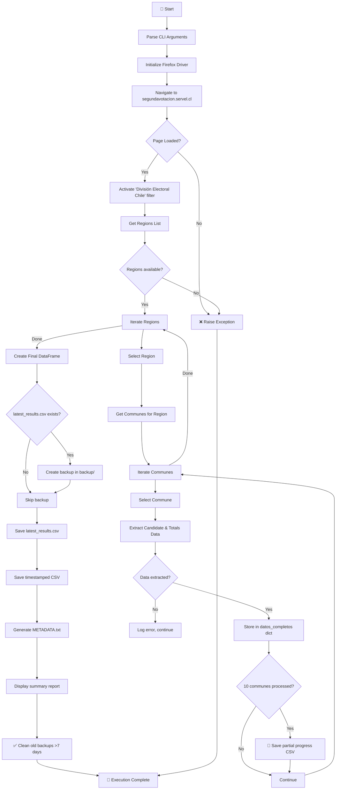
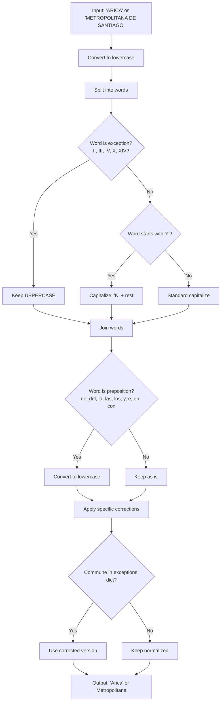
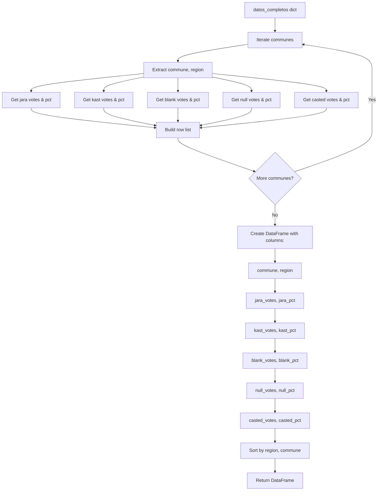

# 🌐 Web Scraper - Chilean Second Round Election 2025

  

  [](https://selenium.dev) 

## 📥 Quick Downloads

| Document | Format |
| :------- | :----- |
| **🇬🇧 English Documentation** | [Markdown](https://github.com/adroguetth/Chilean-Presidential-Elections-2025-Analysis/blob/main/second_round/1_web_scraper/README.md) |
| **🇪🇸 Spanish Documentation** | [Markdown](https://github.com/adroguetth/Chilean-Presidential-Elections-2025-Analysis/blob/main/second_round/1_web_scraper/README_ES.md) |
| **📊 Raw Data (CSV)** | [Download](https://raw.githubusercontent.com/adroguetth/Chilean-Presidential-Elections-2025-Analysis/refs/heads/main/raw/chile_2025_second_round.csv) |

## 📋 General Description

This script is the **second component** of the Chilean Presidential Elections 2025 intelligence system. It automates the extraction of second-round electoral results from the official SERVEL website, processing all communes in Chile and generating structured CSV outputs optimized for data analysis.

The script uses **Selenium** with Firefox WebDriver for browser automation, implements **name normalization** (converting 'ARICA' to 'Arica'), includes **automatic backup** before overwriting results, and provides **partial progress saving** every 10 communes to prevent data loss during long executions.

### Key Features

- **Complete Extraction**: Processes all 346 communes across 16 regions of Chile
- **Second Round Specific**: Optimized for JARA vs KAST presidential candidates
- **Name Normalization**: Converts uppercase names to title format (Arica vs ARICA)
- **Tidy Data Output**: Columns optimized for SQL (`snake_case`), Python, and DAX
- **Automatic Backup**: Creates backup before overwriting `latest_results.csv`
- **Partial Progress**: Saves intermediate results every 10 communes
- **Multi-format Export**: Generates CSV (primary) and Excel (secondary)
- **Metadata Generation**: Automatic documentation of dataset structure
- **Headless Mode**: Support for server/CI/CD environments

## 📊 Process Flow Diagram

### **Legend**

| Color        | Type          | Description                                           |
| :----------- | :------------ | :---------------------------------------------------- |
| 🔵 Blue       | Input / Start | SERVEL website, configuration, CLI arguments          |
| 🟠 Orange     | Process       | Browser automation, data extraction, file operations  |
| 🔴 Red        | Decision      | Conditional branching (selector works?, file exists?) |
| 🟢 Green      | Storage       | CSV outputs, backups, metadata, logs                  |
| 🟣 Purple     | External      | Firefox browser, GeckoDriver                          |
| 🟢 Dark Green | Output        | Final CSV, summary report                             |

### **Diagram 1: Main Flow Overview**


This diagram shows the **high-level pipeline** of the entire script from start to finish:

1. **Start**: Script initializes with CLI argument parsing (`--headless`, `--comunas`, `--verbose`)
2. **Browser Initialization**: Launches Firefox browser with Selenium WebDriver
   - Headless mode option for server environments
   - Window size set to 1920×1080 for proper responsive layout
   - Timeout set to 60 seconds for page loads
3. **Page Navigation**: Navigates to `https://segundavotacion.servel.cl/`
   - **If page fails to load**: Raises exception with error details
   - **If successful**: Proceeds to filter activation
4. **Filter Activation**: Clicks "División Electoral Chile" button
   - Activates the electoral division filter
   - Enables region and commune selection dropdowns
5. **Get Regions**: Extracts all available regions from the dropdown
   - Filters out "Seleccionar" placeholder
   - **If no regions found**: Critical error, script terminates
6. **Region Iteration**: Loops through each region
   - Normalizes region name (removes "DE", "DEL" prefixes)
   - Logs progress for monitoring
7. **Get Communes**: For each selected region, extracts all communes
   - Waits 5 seconds for dropdown to populate
   - **If no communes**: Logs warning, skips to next region
8. **Commune Iteration**: Loops through each commune in the region
   - Respects `--comunas` limit if specified
   - Progress tracked with counters
9. **Data Extraction**: For each commune, extracts electoral results
   - Selects commune from dropdown
   - Waits 6 seconds for data to load
   - Finds and parses results table
   - **If extraction fails**: Logs error, continues to next commune
10. **Data Storage**: Stores extracted data in `datos_completos` dictionary
    - Key: `(commune, region)` tuple
    - Value: `{'candidatos': {...}, 'totales': {...}}`
11. **Partial Progress Save**: Every 10 communes, saves intermediate results
    - Creates CSV with current data
    - Enables recovery if script is interrupted
12. **Final DataFrame Creation**: After all communes processed, builds pandas DataFrame
    - Standardized columns: `commune`, `region`, `jara_votes`, `jara_pct`, etc.
    - Sorts by region, then commune
13. **Backup Creation**: Checks if `latest_results.csv` exists
    - **If exists**: Creates timestamped backup in `backup/` directory
    - **If not exists**: Skips backup step
14. **Save Results**: Writes final data to multiple files
    - `latest_results.csv` (always overwritten)
    - `results_second_round_{communes}_communes_{timestamp}.csv` (historical)
    - `*_METADATA.txt` (auto-generated documentation)
15. **Cleanup**: Removes old backup files older than 7 days
    - Configurable retention period
16. **Output**: Script completes with summary report
    - Total communes processed
    - Regions covered
    - File locations

### **Diagram 2: Commune Data Extraction (per commune)**

```mermaid
flowchart TD
    A[Commune Name] --> B[Select commune from dropdown]
    B --> C[Wait 6 seconds for data load]
    C --> D[Find results table]
    
    D --> E{Table found?}
    E -->|No| F[❌ Return None, None]
    E -->|Yes| G[Get all rows tr]
    
    G --> H[Iterate rows]
    H --> I[Extract cells: Nombre, Votos, %]
    
    I --> J{Nombre contains?}
    J -->|BLANCO| K[Store in totals['blank']]
    J -->|NULO| L[Store in totals['null']]
    J -->|EMITIDO/TOTAL| M[Store in totals['casted']]
    J -->|Candidate name| N[Simplify name: JARA → jara]
    
    N --> O[Store in candidatos dict]
    K --> H
    L --> H
    M --> H
    O --> H
    
    H -->|Done| P[Return candidatos, totals]
```

This diagram details the **per-commune extraction logic** that runs inside the main loop:

1. **Commune Name Input**: Receives raw commune name from region dropdown
2. **Select Commune**: Finds and selects the commune from the dropdown menu
   - Uses XPath: `//select[preceding-sibling::*[contains(text(), 'Comuna')]]`
   - Waits for dropdown to be interactable
3. **Data Load Wait**: Pauses for 6 seconds (`TIEMPO_ESPERA_DATOS`)
   - Allows JavaScript to fetch and render results
   - Critical for dynamic content loading
4. **Find Results Table**: Searches for the main results table
   - Looks for table containing keywords: `CANDIDATO`, `VOTOS`, `PORCENTAJE`
   - **If not found**: Returns `(None, None)` → error logged
5. **Get Table Rows**: Extracts all `<tr>` elements from the table
6. **Row Iteration**: Loops through each row in the table
7. **Extract Cells**: For each row, extracts 3 cells:
   - Cell 0: Candidate/type name (string)
   - Cell 1: Vote count (integer, removes dots)
   - Cell 2: Percentage (float, removes `%` and comma)
8. **Row Classification**: Determines row type by checking cell 0 text:
   - **Contains "BLANCO"** → Stores in `totales['blank']`
   - **Contains "NULO"** → Stores in `totales['null']`
   - **Contains "EMITIDO" or "TOTAL"** → Stores in `totales['casted']`
   - **Candidate name** (not matching above) → Stores in `candidatos[simplified_name]`
9. **Candidate Name Simplification**: Maps full names to codes
   - `"JEANNETTE JARA ROMAN"` → `"jara"`
   - `"JOSE ANTONIO KAST RIST"` → `"kast"`
10. **Return Data**: After processing all rows, returns tuple `(candidatos, totals)`

### **Diagram 3: Name Normalization Process**



This diagram shows how **raw uppercase names** from SERVEL are converted to **clean title format**:

1. **Input**: Receives raw name in uppercase
   - Example commune: `"ARICA"`
   - Example region: `"METROPOLITANA DE SANTIAGO"`
2. **Convert to Lowercase**: Transforms entire string to lowercase
   - `"ARICA"` → `"arica"`
   - `"METROPOLITANA DE SANTIAGO"` → `"metropolitana de santiago"`
3. **Split into Words**: Breaks string by spaces
   - `["metropolitana", "de", "santiago"]`
4. **Check Word Exceptions**: Identifies words that must remain uppercase
   - Exceptions list: `['II', 'III', 'IV', 'VI', 'VII', 'X', 'XIV', 'XV', 'XVI', 'XVIII', 'XIX']`
   - **If exception**: Keeps original uppercase format
   - **If not**: Proceeds to capitalization
5. **Check 'ñ' Character**: Special handling for Spanish letter 'ñ'
   - **If starts with 'ñ'**: Capitalizes as `'Ñ' + rest`
   - **If not**: Standard capitalization (first letter uppercase, rest lowercase)
6. **Join Words**: Reassembles words with spaces
   - `["Metropolitana", "de", "Santiago"]` → `"Metropolitana de Santiago"`
7. **Check Prepositions**: Identifies and lowercases common prepositions
   - Prepositions list: `['de', 'del', 'la', 'las', 'los', 'y', 'e', 'en', 'con']`
   - **If matches**: Converts to lowercase (`de`, `del`, `la`, etc.)
   - **If not**: Keeps current case
8. **Apply Specific Corrections**: Uses predefined dictionary for known exceptions
   - `"Metropolitana de Santiago"` → `"Metropolitana"`
   - `"De Arica y Parinacota"` → `"Arica y Parinacota"`
   - `"Del Libertador General Bernardo O'Higgins"` → `"Libertador"`
9. **Check Exceptions Dictionary**: Compares against known commune/region names
   - **If found**: Returns corrected version from dictionary
   - **If not**: Returns normalized version
10. **Output**: Returns clean, normalized name
    - Commune: `"Arica"`, `"Las Condes"`, `"Ñuñoa"`
    - Region: `"Metropolitana"`, `"Valparaíso"`, `"Biobío"`

### **Diagram 4: Final DataFrame Construction**



This diagram shows how the **`datos_completos` dictionary** is transformed into the **final CSV structure**:

1. **Input**: `datos_completos` dictionary containing all extracted data

   - Structure: `{(commune, region): {'candidatos': {...}, 'totales': {...}}}`

2. **Iterate Communes**: Loops through each key-value pair in the dictionary

3. **Extract Base Fields**: Gets commune name and region name from tuple key

4. **Get Candidate Data**: Extracts candidate dictionary

   - Defaults to empty dict if not present
   - Keys: `'jara'`, `'kast'`
   - Values: `{'votos': int, 'porcentaje': float}`

5. **Get Jara Votes & PCT**: Retrieves Jara's data

   - `jara_votos`: Integer vote count (default 0)
   - `jara_pct`: Float percentage (default 0.0)

6. **Get Kast Votes & PCT**: Retrieves Kast's data

   - `kast_votes`: Integer vote count (default 0)
   - `kast_pct`: Float percentage (default 0.0)

7. **Get Totals Data**: Extracts totals dictionary

   - Defaults to empty dict if not present
   - Keys: `'blank'`, `'null'`, `'casted'`
   - Values: `{'votos': int, 'porcentaje': float}`

8. **Get Blank Votes & PCT**: Retrieves blank vote totals

   - `blank_votes`: Integer (default 0)
   - `blank_pct`: Float (default 0.0)

9. **Get Null Votes & PCT**: Retrieves null vote totals

   - `null_votes`: Integer (default 0)
   - `null_pct`: Float (default 0.0)

10. **Get Casted Votes & PCT**: Retrieves total casted votes

    - `casted_votes`: Integer (default 0)
    - `casted_pct`: Float (default 0.0)

11. **Build Row List**: Assembles all values into a single list

    - Order: `[commune, region, jara_votes, jara_pct, kast_votes, kast_pct, blank_votes, blank_pct, null_votes, null_pct, casted_votes, casted_pct]`

12. **Check More Communes**: Continues loop if more communes remain

    - **If yes**: Returns to step 2 with next commune
    - **If no**: Proceeds to DataFrame creation

13. **Create DataFrame**: Initializes pandas DataFrame with all rows

14. **Define Columns**: Sets column names in exact order

    ```python
    columns = [
        'commune', 'region',
        'jara_votes', 'jara_pct',
        'kast_votes', 'kast_pct',
        'blank_votes', 'blank_pct',
        'null_votes', 'null_pct',
        'casted_votes', 'casted_pct'
    ]
    ```

    

15. **Sort Data**: Sorts DataFrame by region, then commune

    - Uses `df.sort_values(['region', 'commune'])`
    - Ensures predictable, alphabetical ordering

16. **Reset Index**: Resets row index after sorting

    - `reset_index(drop=True)` creates clean 0,1,2... index

17. **Output**: Returns final DataFrame ready for CSV export

## 🔍 Detailed Analysis of `web_scraper.py`

### Code Structure

#### **1. Initial Configuration and Directories**

```python
# Main directories
ARCHIVE_DIR = Path("elections_archive")
BACKUP_DIR = ARCHIVE_DIR / "backup"
LATEST_CSV = ARCHIVE_DIR / "latest_results.csv"
LOG_FILE = ARCHIVE_DIR / "scraper_second_round.log"
```

The script organizes data in a hierarchical structure:

| Directory            | Purpose                           | Retention             |
| :------------------- | :-------------------------------- | :-------------------- |
| `elections_archive/` | Main archive for extracted data   | Permanent             |
| `backup/`            | Temporary backup copies           | 7 days (configurable) |
| `latest_results.csv` | Most recent results (overwritten) | Always current        |
| `results_*.csv`      | Timestamped historical files      | Permanent             |
| `*.log`              | Execution logs                    | Permanent             |


#### **2. Candidate Mapping System**

```python
self.MAPEO_CANDIDATOS = {
    "JEANNETTE JARA ROMAN": "jara",
    "JOSE ANTONIO KAST RIST": "kast"
}
```

This dictionary maps full candidate names from SERVEL to simplified column names:

| Full Name              | Simplified | Column Names             |
| :--------------------- | :--------- | :----------------------- |
| JEANNETTE JARA ROMAN   | `jara`     | `jara_votes`, `jara_pct` |
| JOSE ANTONIO KAST RIST | `kast`     | `kast_votes`, `kast_pct` |


#### **3. Browser Initialization**

```python
def inicializar_navegador(self):
    """Initialize Firefox browser with optimized options"""
    options = Options()
    if self.headless:
        options.headless = True
    options.add_argument("--no-sandbox")
    options.add_argument("--disable-dev-shm-usage")
    options.add_argument("--window-size=1920,1080")
    
    self.driver = webdriver.Firefox(options=options)
```

**Configuration parameters:**

| Parameter                 | Purpose                            |
| :------------------------ | :--------------------------------- |
| `headless=True`           | Run without UI (server/CI/CD mode) |
| `--no-sandbox`            | Required for Linux environments    |
| `--disable-dev-shm-usage` | Prevents /dev/shm issues in Docker |
| `--window-size=1920,1080` | Ensures responsive layout loads    |


#### **4. Name Normalization Functions**

The script implements two normalization functions:

**`normalizar_nombre_comuna()`**: Converts 'ARICA' → 'Arica'

| Input          | Output         | Rule                             |
| :------------- | :------------- | :------------------------------- |
| `ARICA`        | `Arica`        | Capitalize first letter          |
| `LAS CONDES`   | `Las Condes`   | Prepositions in lowercase        |
| `ÑUÑOA`        | `Ñuñoa`        | Respects 'Ñ' character           |
| `PUNTA ARENAS` | `Punta Arenas` | Multiple words handled correctly |

**`normalizar_nombre_region()`**: Converts 'METROPOLITANA DE SANTIAGO' → 'Metropolitana'

| Input                                       | Output          | Rule                         |
| :------------------------------------------ | :-------------- | :--------------------------- |
| `METROPOLITANA DE SANTIAGO`                 | `Metropolitana` | Remove 'DE SANTIAGO' suffix  |
| `DEL LIBERTADOR GENERAL BERNARDO O'HIGGINS` | `Libertador`    | Remove prefix, keep key name |
| `DE VALPARAISO`                             | `Valparaíso`    | Remove 'DE', capitalize      |

#### **5. Data Extraction Logic**

**Table parsing process:**

```python
def _procesar_tabla_resultados(self):
    # Find table with keywords: CANDIDATO, VOTOS, PORCENTAJE
    tabla = self._encontrar_tabla_resultados()
    
    for fila in filas:
        celdas = fila.find_elements(By.TAG_NAME, "td")
        nombre = celdas[0].text.strip()
        votos = int(celdas[1].text.replace('.', ''))
        porcentaje = float(celdas[2].text.replace('%', '').replace(',', '.'))
```


**Row classification:**

| Text contains  | Classification | Storage target       |
| :------------- | :------------- | :------------------- |
| `BLANCO`       | Blank votes    | `totales['blank']`   |
| `NULO`         | Null votes     | `totales['null']`    |
| `EMITIDO`      | Casted votes   | `totales['casted']`  |
| Candidate name | Candidate      | `candidatos[nombre]` |

#### **6. Output File Structure**

**Primary output: `latest_results.csv`**

```text
commune,region,jara_votes,jara_pct,kast_votes,kast_pct,blank_votes,blank_pct,casted_votes,casted_pct,null_votes,null_pct
Arica,Arica y Parinacota,15000,45.50,12000,36.36,500,1.50,27800,84.26,300,0.90
Santiago,Metropolitana,80000,42.30,75000,39.68,1200,0.63,179000,94.68,800,0.42
```

**Column naming convention:**

| Column         | Type    | Description                   |
| :------------- | :------ | :---------------------------- |
| `commune`      | TEXT    | Normalized commune name       |
| `region`       | TEXT    | Normalized region name        |
| `jara_votes`   | INTEGER | Votes for Jeannette Jara      |
| `jara_pct`     | FLOAT   | Percentage for Jara (0-100)   |
| `kast_votes`   | INTEGER | Votes for José Antonio Kast   |
| `kast_pct`     | FLOAT   | Percentage for Kast (0-100)   |
| `blank_votes`  | INTEGER | Blank votes                   |
| `blank_pct`    | FLOAT   | Blank votes percentage        |
| `casted_votes` | INTEGER | Total casted votes            |
| `casted_pct`   | FLOAT   | Total casted votes percentage |
| `null_votes`   | INTEGER | Null votes                    |
| `null_pct`     | FLOAT   | Null votes percentage         |


#### **7. Backup and Cleanup System**

**Backup creation:**

```python
def create_backup_before_update():
    if LATEST_CSV.exists():
        timestamp = datetime.now().strftime("%Y%m%d_%H%M%S")
        backup_filename = BACKUP_DIR / f"backup_latest_results_{timestamp}.csv"
        shutil.copy2(LATEST_CSV, backup_filename)
```


**Cleanup policy:**

| Item    | Retention | Configurable     |
| :------ | :-------- | :--------------- |
| Backups | 7 days    | `days` parameter |

```python
def cleanup_old_backups(days: int = 7):
    """Remove backup files older than specified days."""
```


#### **8. Partial Progress Saving**

```python
def _guardar_progreso_parcial(self):
    if self.comunas_procesadas % 10 == 0:
        filename = f"partial_progress_second_round_{communes}_communes_{timestamp}.csv"
        df_parcial.to_csv(filename)
```

**File naming example:** `partial_progress_second_round_120_communes_20251125_143022.csv`


#### **9. Metadata Generation**

```python
def _crear_archivo_metadatos(self, df, nombre_archivo_csv):
    """Create METADATA.txt with dataset documentation"""
```

**Generated metadata includes:**

- Generation timestamp
- Total communes and regions
- Column descriptions and types
- SQL, Python, and DAX usage examples
- Winner calculation query

---

## ⚙️ Local Execution Guide

### No GitHub Actions (Local Only)

This script is designed for **local execution only** due to:

- **Execution time**: 25-40 minutes (exceeds typical GitHub Actions limits)
- **Browser dependency**: Requires Firefox with GUI (headless mode available)
- **Manual triggering**: Electoral results are one-time events, not weekly

### Execution Triggers

This script runs **only manually**:

| Trigger               | Method                                       |
| :-------------------- | :------------------------------------------- |
| **Command line**      | `python web_scraper.py`                      |
| **Headless mode**     | `python web_scraper.py --headless`           |
| **Test mode**         | `python web_scraper.py --comunas 50`         |
| **Verbose debugging** | `python web_scraper.py --verbose --headless` |

### Environment Variables

| Variable         | Value  | Purpose                                 |
| :--------------- | :----- | :-------------------------------------- |
| `GITHUB_ACTIONS` | `true` | Disables interactive prompts (optional) |

------

## 🚀 Installation and Local Setup

### Prerequisites

- Python 3.7 or higher (3.12 recommended)
- Firefox browser installed
- Git installed (optional)
- Internet access for SERVEL website

### Step-by-Step Installation

#### 1. **Clone the Repository**

```bash
git clone https://github.com/adroguetth/Chilean-Presidential-Elections-2025-Analysis.git
cd Chilean-Presidential-Elections-2025-Analysis/second_round/1_web_scraper
```


#### 2. **Install GeckoDriver**

```bash
# Ubuntu/Debian
sudo apt-get update
sudo apt-get install firefox firefox-geckodriver

# macOS
brew install firefox geckodriver

# Windows
# Download from: https://github.com/mozilla/geckodriver/releases
# Add to PATH or place in script directory
```


#### 3. **Create Virtual Environment (recommended)**

```bash
python -m venv venv

# Windows
venv\Scripts\activate

# Linux/Mac
source venv/bin/activate
```


#### 4. **Install Dependencies**

```bash
pip install -r requirements.txt
```


#### 5. **Run Initial Test**

```bash
# Quick test with only 5 communes
python web_scraper.py --comunas 5 --headless

# Full execution (25-40 minutes)
python web_scraper.py --headless
```


### Development Configuration

```bash
# Simulate headless environment
export GITHUB_ACTIONS=true

# Run with visible browser (remove --headless flag)
python web_scraper.py

# Enable debug logging
python web_scraper.py --verbose
```


------

## 📁 Generated File Structure

```text
second_round/1_web_scraper/
├── web_scraper.py                  # Main script
├── requirements.txt                # Python dependencies
└── elections_archive/
    ├── backup/
    │   ├── backup_latest_results_20251125_143022.csv
    │   └── backup_latest_results_20251124_091503.csv
    ├── latest_results.csv          # Most recent results (always overwritten)
    ├── results_second_round_346_communes_20251125_143022.csv
    ├── results_second_round_346_communes_20251125_143022_METADATA.txt
    ├── partial_progress_second_round_10_communes_20251125_140101.csv
    ├── partial_progress_second_round_20_communes_20251125_140235.csv
    ├── ...
    └── scraper_second_round.log    # Execution log
```

### Naming Convention

| Type                | Pattern                                                      | Example                                                      |
| :------------------ | :----------------------------------------------------------- | :----------------------------------------------------------- |
| Latest results      | `latest_results.csv`                                         | `latest_results.csv`                                         |
| Timestamped results | `results_second_round_{communes}_communes_{timestamp}.csv`   | `results_second_round_346_communes_20251125_143022.csv`      |
| Partial progress    | `partial_progress_second_round_{communes}_communes_{timestamp}.csv` | `partial_progress_second_round_120_communes_20251125_140235.csv` |
| Metadata            | `{csv_filename}_METADATA.txt`                                | `results_second_round_346_communes_20251125_143022_METADATA.txt` |
| Backup              | `backup_latest_results_{timestamp}.csv`                      | `backup_latest_results_20251125_143022.csv`                  |
| Log                 | `scraper_second_round.log`                                   | `scraper_second_round.log`                                   |

------

## 🔧 Customization and Configuration

### Adjustable Parameters in Script

```python
# In web_scraper.py (ScraperSegundaVueltaServel class)
self.TIEMPO_ESPERA_CARGA = 15      # Initial page load (seconds)
self.TIEMPO_ESPERA_SELECCION = 5   # Region/commune selection
self.TIEMPO_ESPERA_DATOS = 6       # Wait after selection

# Backup retention
def cleanup_old_backups(days: int = 7):
    """Modify days parameter for different retention"""
```


### CLI Arguments

| Argument      | Description                       | Example                              |
| :------------ | :-------------------------------- | :----------------------------------- |
| `--headless`  | Run Firefox without GUI           | `python web_scraper.py --headless`   |
| `--comunas N` | Limit to N communes (for testing) | `python web_scraper.py --comunas 50` |
| `--verbose`   | Enable detailed debug logging     | `python web_scraper.py --verbose`    |

### Modify Candidate Mapping

```python
# If candidate names change on the site, update:
self.MAPEO_CANDIDATOS = {
    "NEW_JARA_NAME": "jara",
    "NEW_KAST_NAME": "kast"
}
```


### Process Only Specific Regions

```python
# Modify in _procesar_region method:
desired_regions = ["METROPOLITANA DE SANTIAGO", "DE VALPARAISO"]
if region_nombre in desired_regions:
    # Process region
else:
    continue
```


------

## 📈 Performance Estimates

| Metric                   | Value                    |
| :----------------------- | :----------------------- |
| ⏱️ Total execution time   | 25-40 minutes            |
| 🏙️ Communes per hour      | 500-600                  |
| 🧠 RAM usage              | ~500 MB                  |
| 💾 Storage per execution  | 20-50 MB                 |
| 💾 Partial save frequency | Every 10 communes        |
| 🔄 Retry logic            | Individual commune level |

------

## 🐛 Troubleshooting

### Common Issues and Solutions

| Error                                       | Likely Cause                | Solution                         |
| :------------------------------------------ | :-------------------------- | :------------------------------- |
| `GeckoDriver not found`                     | Missing WebDriver           | Install firefox-geckodriver      |
| `Timeout waiting for table`                 | Slow connection/SERVEL down | Increase `TIEMPO_ESPERA_CARGA`   |
| `Element not found`                         | Website structure changed   | Run with `--verbose`, check logs |
| `No such element: Unable to locate element` | Selector失效                | Update XPath selectors in script |
| `Firefox not installed`                     | Missing browser             | `sudo apt-get install firefox`   |

### Debugging with Verbose Mode

```bash
python web_scraper.py --verbose --comunas 10
```


**Verbose output includes:**

- Browser console logs
- Element search attempts
- DataFrame construction details
- File save confirmations

### Real-time Monitoring

```bash
# Follow execution log
tail -f elections_archive/scraper_second_round.log

# Search for specific errors
grep "ERROR" elections_archive/scraper_second_round.log
grep "WARNING" elections_archive/scraper_second_round.log

# Check progress by viewing partial files
ls -la elections_archive/partial_progress_*.csv
```


### Recovery from Interruption

If the script is interrupted (Ctrl+C or crash):

1. **Latest partial progress file** contains data up to last 10 communes
2. **Restart script** - it will overwrite with complete run
3. **Or merge partial results** manually using pandas

------

## 📄 License and Attribution

- **License**: MIT
- **Author**: Alfonso Droguett
  - 🔗 **LinkedIn:** [Alfonso Droguett](https://www.linkedin.com/in/adroguetth/)
  - 🌐 **Web portfolio:** [adroguett-portfolio.cl](https://www.adroguett-portfolio.cl/)
  - 📧 **Email:** adroguett.consultor@gmail.com
- **Dependencies**:
  - Selenium (Apache 2.0)
  - Pandas (BSD 3-Clause)
  - OpenPyXL (MIT)

------

## 📊 Pre-extracted Data

If you don't want to run the scraper, the latest results are available as raw data:

**URL:** https://raw.githubusercontent.com/adroguetth/Chilean-Presidential-Elections-2025-Analysis/refs/heads/main/raw/chile_2025_second_round.csv

```bash
# Download directly
curl -O https://raw.githubusercontent.com/adroguetth/Chilean-Presidential-Elections-2025-Analysis/refs/heads/main/raw/chile_2025_second_round.csv

# Or with wget
wget https://raw.githubusercontent.com/adroguetth/Chilean-Presidential-Elections-2025-Analysis/refs/heads/main/raw/chile_2025_second_round.csv
```

------

## 🤝 Contribution

1. Report issues with complete logs
2. Update selectors if SERVEL changes interface
3. Maintain backward compatibility with output format
4. Test changes locally with `--comunas 10` before full run
5. Document new features in this README

------

**⭐ If this project is useful to you, please consider giving it a star on GitHub!**
